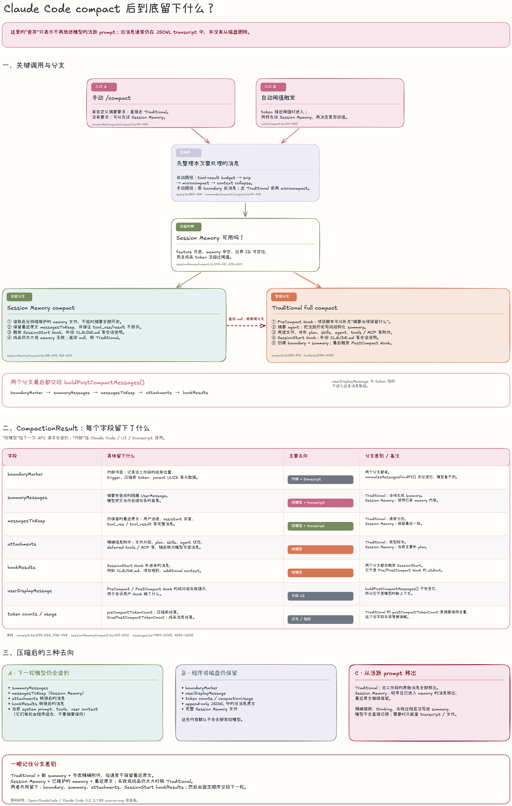
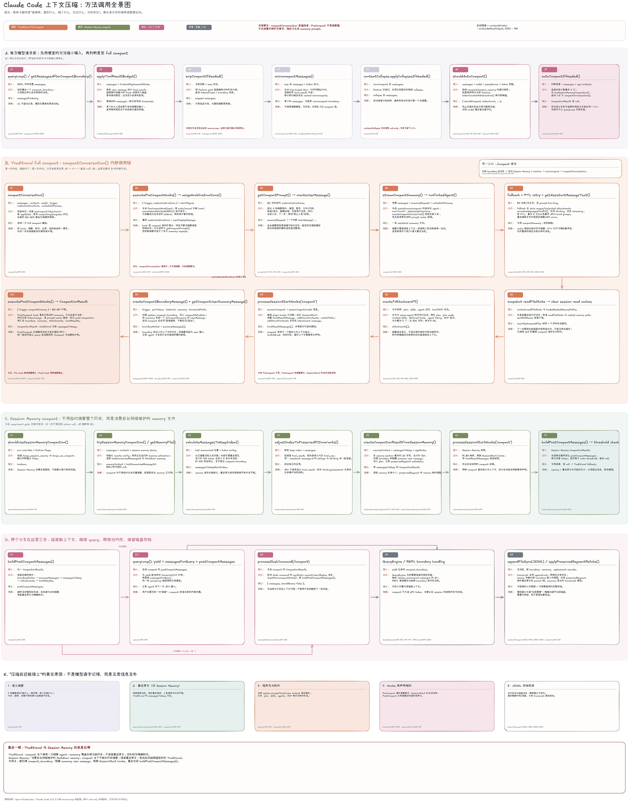

+++
title = "Claude Code Compact"
slug = "Claude-Code-Compact"
date = "2026-08-02T20:48:48+08:00"
lastmod = "2026-08-02T20:48:48+08:00"
draft = false
description = "沿着 Claude Code 2.1.88 TypeScript 源码梳理 compact 机制，解释 summary、最近原文、程序状态、附件、Hooks 和 transcript 如何配合续接任务。"
categories = ["AI"]
tags = ["Claude", "Claude Code", "AI", "工作流"]
obsidian_path = "/AI/Claude Code Compact"
+++
# Claude Code Compact

这次是沿着 Open-ClaudeCode 里恢复出来的 Claude Code 2.1.88 TypeScript 源码，专门看了一遍 compact。我把它理解成“对话太长时生成一个摘要”，但顺着调用继续看会发现，摘要只是其中一层。真正让任务在 compact 后还能接着做的，是 summary、最近原文、程序状态、附件、Hooks 和 transcript 一起配合。

<mark class="hltr-green-light">compact 的核心是把旧消息移出模型的活跃 prompt，再用可继续执行任务的信息替代它；旧消息通常仍在 JSONL transcript 中，并没有从磁盘删除。</mark>

## 背景与问题

Claude Code 跑的是一个持续的 agent loop。用户消息、assistant 回复、thinking、tool_use、tool_result 会在 turn 之间不断累积，其中工具结果往往增长得最快。窗口快满时，如果仍把整段历史交给模型，下一次请求就会超过窗口上下文，所以 compact 必须在请求前腾出空间。

自动路径会根据模型窗口计算阈值：

```text
effectiveWindow = contextWindow - min(modelMaxOutput, 20K)
autoCompactThreshold = effectiveWindow - 13K
```

如果按 200K 上下文窗口、模型输出上限不小于 20K 来算，大约会在 167K 附近触发。手动执行 `/compact` 则不需要等阈值，可以主动整理当前会话。

### Message

到这里还有一个容易混淆的地方：源码里的 `Message` 并不等于界面上的一条聊天气泡。它更像 Claude Code 保存的一只消息信封：

```text
Message                       Claude Code 外层记录
├── type                      user / assistant / system / attachment / progress
├── uuid、timestamp           链路和存盘信息
└── message                   接近 Anthropic API 的消息
    ├── role                  user / assistant
    └── content[]             text / thinking / tool_use / tool_result ...
```

所以图里出现的 `messages` 是一组消息信封，`content` 是信封里的具体内容块，`trigger` 则表示本次 compact 是 `manual` 还是 `auto`。方法卡里的 input / output 也只是函数参数与返回值，并不是键盘输入和屏幕输出。

### Tool result

沿着消息结构再往下看，最容易让上下文快速增长的是 `tool_result`。模型先在 `AssistantMessage` 里发出 `tool_use`，Claude Code 执行对应工具，再把结果包装进下一条 `UserMessage`。这里的 `user` 不代表用户亲手输入，它表示运行环境把外部结果交还给模型。

```text
AssistantMessage
└── tool_use
    ├── id: toolu_123
    ├── name: Read / Bash / Grep ...
    └── input: 工具参数

UserMessage
├── message.role: user
├── message.content[]
│   └── tool_result
│       ├── type: tool_result
│       ├── tool_use_id: toolu_123
│       ├── content: 工具输出          // 下次请求发送给模型
│       └── is_error: 是否执行失败
├── toolUseResult: Claude Code 内部的原始结果
├── sourceToolAssistantUUID: 对应 assistant 消息的 UUID
└── mcpMeta: MCP 的 _meta / structuredContent
```

`tool_use.id` 与 `tool_result.tool_use_id` 必须对应，模型才能知道这是哪次工具调用的结果。`content` 才是下一次 API 请求会发送给模型的主要内容：Read 会放文件正文，Bash 会放 stdout、stderr 和错误信息，Grep / Glob 会放匹配结果或路径，MCP 工具还可能返回文字、图片或资源引用。工具失败时一般会设置 `is_error: true`，并在 `content` 中说明失败原因。

外层字段承担的是另一类用途。`toolUseResult` 保存 Claude Code 内部使用的原始工具返回对象；`sourceToolAssistantUUID` 负责连接结果与发起工具调用的 assistant 消息；`mcpMeta` 提供给 SDK 或 MCP 消费者，其中的元数据不会直接发给模型。因此需要区分“模型可见的 `tool_result.content`”与“程序内部保存的原始结果”，它们并不是同一份数据。

<mark class="hltr-pink">工具结果之所以优先处理，主要是因为它的体积增长很快，但后续价值往往低于用户目标、当前决策和最近修改。</mark>
一次 Bash 可能产生几万行日志，一次 Read 可能返回完整大文件；如果这些内容在每轮请求中反复发送，不仅会占用上下文窗口，还可能让摘要请求本身出现提示词过长的问题。另一方面，很多工具结果只是磁盘文件或命令输出的临时副本，需要精确内容时仍可以读取文件或 transcript，没有必要长期放在活跃 prompt 中。

所以 Claude Code 会先处理 `tool_result.content`。`tool-result budget` 针对单条消息中过大的新工具结果，`microcompact` 则偏向清理较早的工具结果，保留 `tool_use` / `tool_result` 的关联结构，只移除大段旧内容。

它把完整工具输出保存到磁盘，再将 `tool_result.content` 替换为一段包含文件位置的短预览。同时，它会在 transcript 中记录这次替换，让后续请求和会话恢复时继续使用同一段预览，避免历史消息前后不一致，影响 prompt cache 的复用。

```text
原来的 `tool_result.content` 会被替换成类似
{
  type: "tool_result",
  tool_use_id: "toolu_123",
  content: "结果过大，完整内容保存在 xxx；以下是部分预览……"
}
```

这样处理有两个好处：一部分会话可能不用全量压缩；即使仍要生成 summary，摘要 agent 需要读取的输入也会更小。更关键的是，它没有先改写用户意图和任务决策，只拿掉可从磁盘或 transcript 查回的大块结果，所以会排在语义摘要之前。

## 基本流程

每次准备向模型发起下一轮 API 请求前，`queryLoop()` 都会先整理即将发送的消息：`tool-result budget → history snip → microcompact → context collapse`。例如巨大 `tool_result` 可以先写到磁盘，只在 prompt 里留下预览；`history snip` 不调用模型，它过滤已经被标记 snip 的历史消息段；`microcompact` 清除较早的工具结果且不产生摘要。只有这些处理仍无法把 token 降到阈值以下时，才会进入 full compact，用语义摘要替换旧对话。

接下来会先判断实验性的 Session Memory 是否可用。自动 compact 会先试这个分支；手动 `/compact` 在没有自定义摘要要求时也可以先试。如果 Session Memory 关闭、memory 文件无效、无法定位边界，或者压缩成品仍然超过阈值，就转入 Traditional full compact。



这张图适合先看最终的结果。上半部分是入口与分支，中间是 `CompactionResult` 的字段，下面区分了哪些内容给模型、哪些只留在程序或磁盘、哪些从活跃 prompt 移出。

## Traditional full compact

Traditional 分支由 `compactConversation()` 统一安排。它先触发 `PreCompact` Hook，把 `{ 触发器 trigger, 自定义指令 customInstructions }` 交给用户或项目配置的 Hook。Hook 成功输出的 stdout 会被拼进 `customInstructions`，然后 `getCompactPrompt()` 才生成摘要要求。因此 PreCompact Hook 自己不写摘要，它要求这次摘要必须额外保留什么。这也解释了它为什么必须出现在 summary prompt 之前。

后面会启动一个单回合摘要 agent。这个 agent 不允许调用工具，因为它的任务只是读取现有历史并生成 summary；如果工具调用占掉唯一回合，反而拿不到摘要。摘要模板要求覆盖用户意图、技术概念、文件和代码、错误与修复、用户修正、待办、当前工作和下一步，目的是尽量保住任务可以继续执行的语义。

但 summary 不适合逐字保存代码和程序状态，所以摘要完成后，Claude Code 还会再读最近访问的文件，并补回 plan、skills、plan mode、后台 agent、deferred tools 和 MCP 信息。随后触发 `SessionStart('compact')`，让 CLAUDE.md、项目规则和 Hook additional context 再进入会话。最后才创建 `compact_boundary` 与隐藏的 summary user message，并触发 `PostCompact` Hook。

三类 Hook 的职责不同：

- **PreCompact**：发生在摘要 prompt 生成前，可以追加摘要要求
- **SessionStart**：compact 形成新的工作上下文后，补回 CLAUDE.md 和会话级说明
- **PostCompact**：summary 已经产生后，用于通知或审计；它的显示信息不会进入下一轮模型上下文

### PTL retry

Prompt Too Long。

如果历史已经大到连“请摘要这些消息”这次请求都塞不进 context window，就会出现 PTL。Claude Code 会从消息开头移除最早的一组 API round，再发起摘要，最多做三次。

API round 是一组相互关联的 user、assistant、tool_use 和 tool_result。按组移除可以避免留下找不到对应 tool_use 的 tool_result。之所以先舍去开头，是因为最近的修改、报错和用户要求对续接当前任务更有价值。但是被 PTL 流程移除的消息根本没有进入摘要 agent，所以也不会出现在 summary 里，只能从 transcript 查回。三次之后仍然超过窗口，本次 compact 就会失败。

## Session Memory compact

Session Memory 走的是另一条思路：后台平时就在维护一份 Markdown memory，compact 时直接使用这份 memory，不再临时摘要全部历史。它还会保留最近一段 `messagesToKeep`，一般至少覆盖约 10K token 和 5 条含文本的消息，向前扩展到约 40K 附近停止。

保留最近原文时不能只按 token 切一刀。如果留下了 tool_result，就必须把对应的 tool_use 一起留下；同一个 assistant message ID 下的 thinking 和其他内容块也不能被拆散。处理完这些边界后，Session Memory 同样会触发 SessionStart Hook，并把 memory、最近原文、plan 和 Hook 结果组合起来。

再往下看，会发现实验分支并不保证一定成功。memory 文件为空、last summarized message ID 找不到，或者组合后的消息仍然超过自动阈值时，`trySessionMemoryCompaction()` 会返回 `null`，调用方随后转入 Traditional。这也是图里虚线箭头的含义。

## compact 后保留的内容

两个分支最后都会生成 `CompactionResult`，再由 `buildPostCompactMessages()` 按固定顺序摊平成新的工作消息：

```text
boundaryMarker
→ summaryMessages
→ messagesToKeep
→ attachments
→ hookResults
```

这些字段虽然都出现在返回对象里，但去向并不一样：

| 字段 | 保存的内容 | 主要去向 | 分支差别 |
| --- | --- | --- | --- |
| `boundaryMarker` | 内部书签，记录旧工作段的结束位置、trigger、压缩前 token、parent UUID 等元数据 | Claude Code + transcript | 两个分支都有；API 归一化时会过滤，模型看不到 |
| `summaryMessages` | summary 包装成的隐藏 `UserMessage` | 模型 + transcript | Traditional 当场生成；Session Memory 使用已有 memory |
| `messagesToKeep` | 仍保留的最近原文，包括 user、assistant、tool_use、tool_result | 模型 + transcript | Traditional 通常为空；Session Memory 会保留最近一段 |
| `attachments` | 文件片段、plan、skills、agent 状态、tools / MCP 等精确信息 | 模型 | Traditional 类型较多；Session Memory 当前主要补 plan |
| `hookResults` | SessionStart Hook 补进来的 CLAUDE.md、项目规则和 additional context | 模型 | 两个分支都会产生；它不是 Pre/PostCompact Hook 的 stdout |
| `userDisplayMessage` | PreCompact / PostCompact Hook 的成功或失败提示 | UI | 不在 `buildPostCompactMessages()` 中，因此不是模型上下文 |
| token counts / usage | 压缩前估算、摘要调用用量、压缩成品估算 | 日志 / 指标 | Traditional 的 `postCompactTokenCount` 是摘要 API 调用总量；成品大小看 `truePostCompactTokenCount` |

这里需要把“保留”再分成三种去向。下一轮模型会读到 summary、Session Memory 的最近原文、转换后的 attachments 与 hookResults；当前 system prompt、tools、user context 也会由程序在每轮请求时组合。Claude Code 和磁盘还会保留 boundary、UI 显示信息、token 指标、JSONL 里的旧消息以及完整 memory 文件，只是默认不把它们全部发给模型。

从活跃 prompt 移出的内容也因分支而不同：Traditional 会移出旧工作段的原始消息，Session Memory 只移出较早且已进入 memory 的部分，并保留最近原文。精确措辞、thinking、失败过程如果没有进入 summary，模型就不能直接引用；遇到需要逐字核对的代码或报错时，仍要回到 transcript 或文件。

## 源码调用图



这张图适合需要定位方法时查看，按 A → B/C → D 的区域顺序找入口、分支和汇合点，再进入对应方法。

这份仓库是 source-map 恢复出来的 TypeScript 快照，`reactiveCompact`、`contextCollapse`、部分 cached microcompact 等 ant-only 文件并不完整，所以这些机制目前只能确认调用入口，不能把内部细节当成已经完全验证的结论。

## 复习

Claude Code 并没有在 compact 后逐字记住旧对话。它保存了能够续接任务的 summary，用 attachments 和 SessionStart 补回精确信息，在实验分支里保留最近原文，同时把完整旧记录留在 transcript。这样下一轮模型拿到的是更短的工作上下文，但需要逐字核对的旧细节仍然有地方可查～
