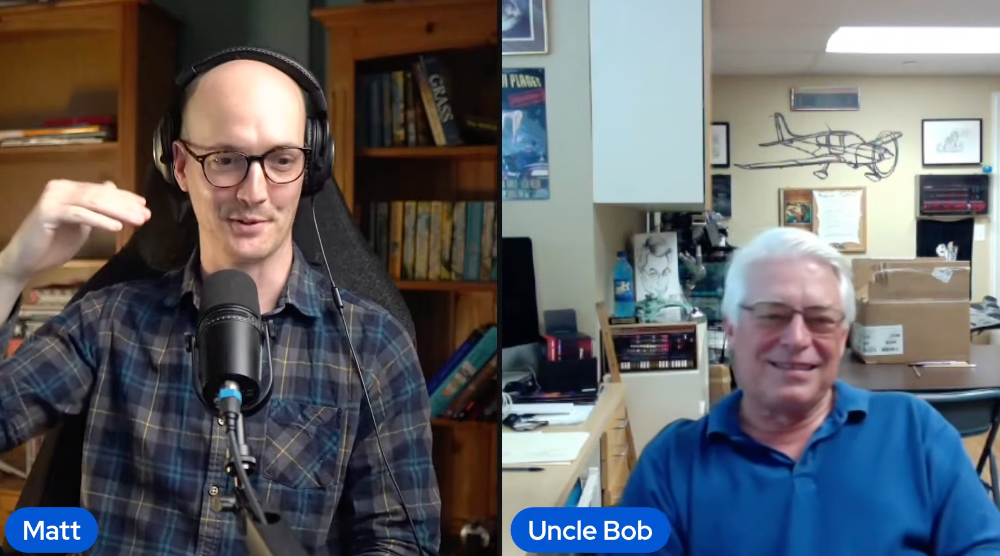

+++
title = "Matt 与 Uncle Bob 的博客访谈"
slug = "Matt-与-Uncle-Bob-的博客访谈"
date = "2026-09-08T20:00:00+08:00"
lastmod = "2026-09-08T20:00:00+08:00"
draft = false
description = "记录 Matt 与 Uncle Bob 关于 Agent、确定性工具、多 Agent 工作流、模块设计与软件基本功的访谈观点。"
categories = ["AI"]
tags = ["AI", "Agent", "Matt Pocock", "Uncle Bob", "软件工程"]
obsidian_path = "/AI/Matt 与 Uncle Bob 的博客访谈"
+++
# Matt 与 Uncle Bob 的博客访谈

在油管上看到最喜欢的 Skill 博主 Matt 发布了跟元老级的人物 Uncle Bob 的播客访谈，个人觉得非常高质量，遂记录。

（前面是一些寒暄，然后 Matt 引入了大模型 Agent 的一些东西，同时问 Bob 对这些的看法....）
Bob：
> 我就想，这东西快是快，但恼火的是它把我拖慢了。嗯。
> 只要它们快——它们确实快。
> 只要能把它们约束好，我就不拿我的慢去拖累它们。
> 我的慢，就是某种粒度上审代码、查代码。

Matt：
> 所以你的目标是把自己从代码里抽出来，不靠人工审查，在代码周围搭一层脚手架，自己尽量少碰，还要把 agent 拘在最紧的束缚衣里，让它没法犯错。
> 那烂代码为什么烂？我们为什么在意？它们这么快、跑这么猛，我们在意什么？何苦搭这一整套 Harness？
>  直接让 Agent 大力出奇迹直接修，让 bug 自己消失不行吗？

Bob：
> 代码烂到一定程度，agent 也扛不住。
> 进入一种模式：改好一处，顺手弄坏另一处。
> 然后开始空转，越弄越糟，束手无策。

在 context window 中，随着上下文不断变长，“lost in the middle“ 现象就会慢慢浮现，即模型对于比较久的和最新的对话的记忆比较清楚，但是在中间的内容却很难记得住。开头和结尾的内容权重高，中间的会被弱化.....

<mark class="hltr-pink">提示词中的对于代码的约束，由于上下文变长，这些约束可能就处于内容的“中间”，指令就会被忽视。这些约束最终会被上下文淹没</mark>
Bob：
> 用 agent 的关键——这非常难做到——是把初始 prompt 削到最短。

所以他的建议是：
> 尽量让内容都留在它的优先区。
> 而且比如像确定性工具这种外部的东西，就不会失踪。需要做的时候模型直接调用就好了
> 然后靠确定性工具事后把关

Matt 对此的回应是：
> 完全同意。所以你放弃了引导，回头捡起了自动化检查的老手艺。

那为什么说确定性工具就不会被忽视呢？
Matt：
> 因为这些检查不像引导指令那样进上下文窗口，
> 所以可以一层层往上叠、随便叠。

但一直往上叠也不是一件好事，对于自检性比较强的模型来说：<mark class="hltr-green-light">这会不会算是一种负担，会不会测试过头了？</mark>这也是在探讨的地方

Matt：
> 那如果语言本身有强类型、又有测试，这幅图景对你来说什么样？

Bob：
> 如果叠的过多显然是有的，甚至比人还慢。但是只要确保生产的效率还是在人之上，那还是能接受的

<mark class="hltr-green-light">这些确定性工具实际上就是一层层的 loop，用这些确定性工具，实质是把它们放进循环。在循环里下命令：改，改到这个测试确认通过为止。</mark>

经过一层又一层的检查，agent 也会做复杂性校验，解耦，补测试，拆函数等等.....得折腾一阵子才能完成一个 loop

> 等于拿生产率换质量。
> 得折腾一阵才能全部达标。

于是 Uncle Bob 尝试使用多 Agent 来完成这些事情：干活 -> 审查 -> 测试 -> 加固 -> ..... 一直循环往下，这就引入了多 agent 话题
Bob 列出了多 agent 的好处：
> 一是能并行跑。
> 二是 agent 聚焦单一任务时，上下文窗口可控。
> lost in the middle 的毛病就轻多了。

ps：这里的 "lost in middle" 在上面的 context window 有提到过。

> 头部多放几条规则——别太多——它们就更愿意遵守。
> 还可以让 agent 生、干活、死，下一个带着干净上下文进场。

Matt 对 Uncle Bob 的多 Agent 的工作流的评价是：
> 我最近在想：所以你操盘的不只是上下文窗口。
> 好比说上下文窗口、或者说会话，是有"轨迹"的：就像是你让它做过一件事、之后同一会话里的所有动作都会顺着这条轨迹走。
> 比如你让它测过一次 UI，之后不管改多少轮，它每次都要测 UI。
> 那么清掉轨迹的唯一办法就是清空上下文窗口。
> 拿实现 agent 举例：只求跑通的轨迹，用不上盯着 100% 覆盖率，搞那么执拗。

Bob 对此持同意看法：
> 你这个"轨迹"的说法很到位。
> 只要方向不乱、上下文里前后一致，就不容易出现大家常碰到的疯狂幻觉。

只要代码前提设计模块得好，效率的杠杆就会大的惊人。
那为什么好的模块结构非常重要？这个道理跟垃圾代码的角度来说是一样的：

> 分区清晰、接口规矩的东西，人才能把握，因为大脑本来就靠分块思考。

但是 agent 对 spec 的东西写的过于详细了，plan 的非常细致，但是执行的时候往往达不到预期的效果

Bob：
> 我最近改成了这样：不再写规约去定义我想要什么、甚至我有什么。
> 我看着最终产物说：它本身就是规约。

这句话这值得深思....

Matt：最后一个问题
> 再借一次 John Ousterhout：他对编程类型的定义特别精彩。

随机他引出了"战术式编程"，即：
> 战术对战略。
> 战术是地面上的军士、真刀真枪打仗的人；战略就是将军、决定战争走向的人。
> 那么现在的 agent 战术超强，但战略超烂。现在战术活全被 AI 做了，那刚入行的人怎么办？
> 战略编程怎么学?

Bob's answer:
> 首先，程序员该受的训练，不管在大学还是别处，核心就是写代码。起码写上一年。多久不好说，总之要写到知道 agent 面对的是什么。
> 下一步：你进了重度使用 agent 的公司，你这个刚出训的年轻人，就该被当成一个 agent 对待。
> 主管工程师也好、谁也好，那个手里跑着一串 agent，自己当将军的人，应该把你当一个 agent 看：派同样的活，上同样的确定性工具。
> 你该这么干上几个月，产出难看死了，但能学到海量的东西。
> 这套关卡闯完，也许就配让你自己带 agent 了。说不准。（?

就像是：

> 没写过汇编的，该花一个周末写写汇编，才知道幕后到底发生了什么。

Bob 对此的解释具体为：
> agent 是代码之上的一层抽象。
> 代码在下面，而抽象层——你刚才说的模块查看器就是这意思——
> 在代码上架这种抽象，是很棒的学习方式。
> 再往下钻时，理解就深一层。

Matt 有感： agent 相当于加速了你的学习进程，比如：
> 干六个月就跳槽的人，可能永远学不到战略编程。 因为他们的错误要九个月后才显形。
> 自己的错，自己永远看不见。
> 但有了 agent，就看得见了。
> 一切加速，犯错后的反馈来得更快更密。
> 去年 12 月你看着 agent 的产出说"这是坨狗屎"—— 那你是怎么识别出来的？

Bob 对此疑问的回答是：重点不在于怎么认出来，是要看 agent 挣扎，看到 agent 对这些产出不能很好的执行时，那就说明大概率是狗屎了
原话：
> 一开始就是肉眼看代码，看见狗屎。
> 那不是重点。重点是下一步：看它们挣扎。
> 难就难在这：新手进来，认不出那种挣扎。

那怎么学呢？看书👀，软件的基本功还是很重要的！

Bob：
> 软件是人类尝试过最复杂的东西，比我们试过的任何事都复杂，软件就是最复杂的。
> 所以<mark class="hltr-green-light">基本功是把这种复杂度组织成可把握形态的方法</mark> ——不光人把握得了，model 也把握得了，毕竟 model 本就是照着人造的。
> 基本功依然成立，因为我们就是靠它<mark class="hltr-green-light">把复杂度驯化成可理解的形态</mark>。
> 现在有人说基本功不重要了。他们会懂的，会碰壁懂的那种，而且用不了多久。但说不定比我预想的久，毕竟 agent 确实强。
> 但我亲眼见过它们撞墙。眼下这个局面，处处是历史的重演。

怎么个重演呢？Bob 原话：
> 刚才 Matt 提到的抽象层，现在我们站在了编译器之上，从前的抽象层是编译器，往前就是汇编、二进制，现在抽象层已经上升到了 model 这一层。
> 抽象层每升一级，底下一层的人都会抱怨："我们饭碗都没了，sth like that..."，每一次都是这样。现在又到新的阶段，下面的人又喊："完了全完了！"，这显然是不会的。

后面是 Bob 的最后的几句，我觉得应该贴上原字幕印象会更加深刻～

我把最精简的部分都总结出来了，如果对此播客感兴趣的，地址在👇
[LIVE: Uncle Bob on Software Fundamentals in the Age of AI](https://www.youtube.com/watch?v=zcLPGC-tvgk)

看完只能说：小编要 n 刷这次播客了，感受颇深，受益匪浅呀。希望大家也能从中受到启发，祝大家变得更强！
