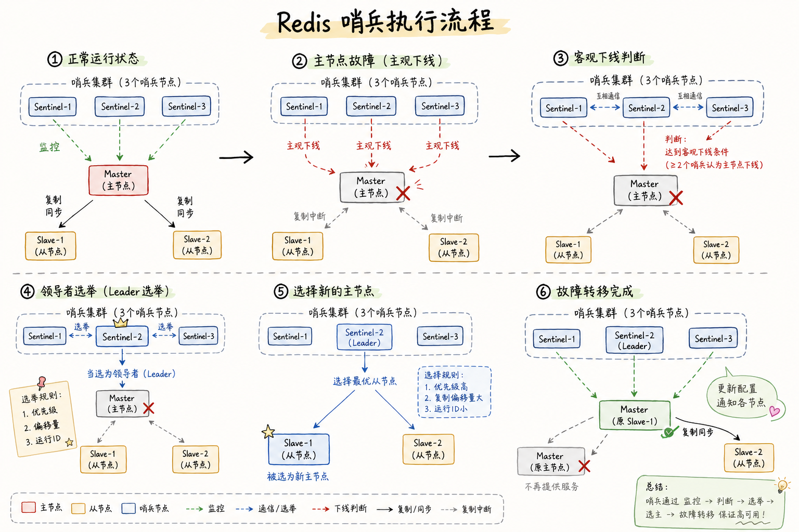
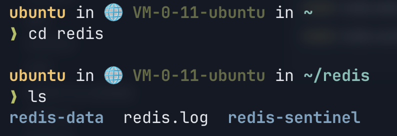
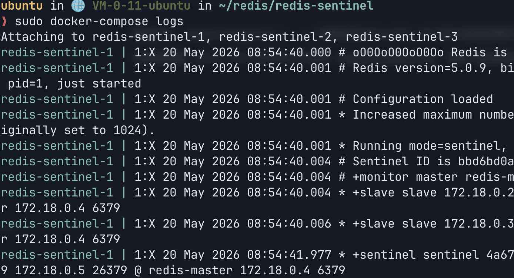
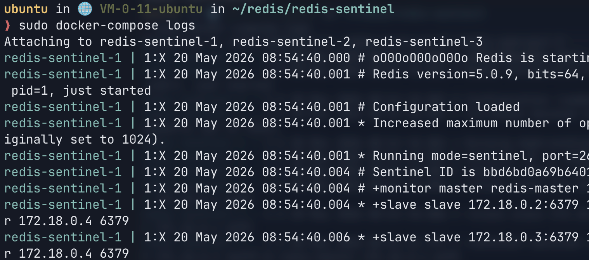

+++
title = "Redis 哨兵"
slug = "Redis-哨兵"
date = "2026-05-31T22:26:24+08:00"
lastmod = "2026-05-31T22:26:24+08:00"
draft = false
categories = ["Redis"]
description = "记录 Redis Sentinel 如何在主从复制基础上完成监控、选主、故障转移，以及用 Docker 搭建一主二从三哨兵的练习过程。"
+++

Redis 的[主从复制]()模式下，一旦主节点不能提供服务，就需要人工进行主从切换，这非常麻烦。后续如果要解决单机存储容量限制，需要继续看[集群]()。

## 主从复制局限性

主从复制能够很好地平衡数据一致性问题，但是当遇到故障时，还是会遗留一些问题：

1. 主节点发生故障时，需要手动切换主节点，非常复杂。
2. 主节点能够将读压力分担到从节点中，但是主节点仍然承担写压力，受到单机限制。

来看第一个问题，如果出现故障了，大致流程是：

1. 检查主节点是否健康，是否还能工作或抢救。
2. 如果短时间不能排查问题，则需要手动挑一个从节点设置为新的主节点。
3. 把选好的从节点通过 `slaveof no one` 升级成主节点。
4. 再将原来的从节点通过 `slaveof 主节点的 ip port` 连上新的主节点。
5. 修改客户端配置，让客户端能够顺利连接到另一个主节点。

这步骤看着都头疼...于是 Redis 就引入了哨兵来解决这个问题。通常哨兵也不会只设置一个，而会部署一个哨兵集群，防止哨兵挂了或单个哨兵误判。

## 实现原理



正常运行状态时，哨兵集群中的每个节点都是单独的 `redis-sentinel` 进程，会监控现有的 `redis-master` 和 `slave`。它们的监控是通过 TCP 长连接定期发送心跳包。

不过，一个哨兵节点发现主节点挂了还不够，需要多个哨兵节点共同认同这件事，才会进行接下来的操作，主要是为了防止误判。

当多数哨兵都认为主节点挂了，就会接着往下操作：

- 哨兵节点中会先挑选出一个 leader，由这个 leader 负责从现有从节点中挑选一个作为新的主节点。leader 会通过投票方式选出，每个哨兵都有一票，票数多的成为 leader。
- 挑选出从节点后，哨兵会控制这个节点执行 `slaveof no one`，并控制其他节点修改 `slaveof` 到新的主节点上。
- 然后自动通知客户端。

## Docker 部署

这里使用 Docker 做多个 Redis 的部署练习，结构是一个主节点、两个从节点、一个哨兵集群（三个 sentinel）。

### 主从节点配置

在云服务器上运行 Docker，首先要安装 Docker：

```bash
apt install docker-compose
```

如果本身有 Redis 进程，可以先停掉之前的服务：

```bash
service redis-server stop
```

然后使用 Docker 拉取 Redis 镜像：

```bash
docker pull redis:5.0.9
```

首次拉取可能会出现拉取超时，这是由于国内网络环境导致的。要么给云服务器加代理，要么配置镜像源。我这里配置了镜像源，只需要逐条执行即可：

```bash
sudo mkdir -p /etc/docker
sudo tee /etc/docker/daemon.json >/dev/null <<'EOF'
{
  "registry-mirrors": [
    "https://docker.1ms.run",
    "https://hub-mirror.c.163.com"
  ]
}
EOF

sudo systemctl daemon-reload
sudo systemctl restart docker
sudo docker pull redis:5.0.9
```

最后使用下面的命令查看镜像是否拉取成功：

```bash
docker images
```

我们需要创建两个文件夹。建议在主目录中建一个 `redis` 文件夹，在里面再分成 `redis-data` 和 `redis-sentinel` 文件夹：

```bash
mkdir redis
cd redis
mkdir redis-data
mkdir redis-sentinel
```

最终你在 `redis` 目录中会有这两个文件夹：



进入 `redis-data`：

```bash
cd redis-data
```

新建配置文件：

```bash
vim docker-compose.yml
```

注意这个文件名称必须是 `docker-compose.yml`，然后把这段配置粘贴进去：

```yaml
version: '3.7'
services:
  master:
    image: 'redis:5.0.9'
    container_name: redis-master
    restart: always
    command: redis-server --appendonly yes
    ports:
      - 6379:6379
  slave1:
    image: 'redis:5.0.9'
    container_name: redis-slave1
    restart: always
    command: redis-server --appendonly yes --slaveof redis-master 6379
    ports:
      - 6380:6379
  slave2:
    image: 'redis:5.0.9'
    container_name: redis-slave2
    restart: always
    command: redis-server --appendonly yes --slaveof redis-master 6379
    ports:
      - 6381:6379
```

最后启动：

```bash
docker-compose up -d
```

### 哨兵配置

进入哨兵文件夹：

```bash
cd redis-sentinel
```

同样创建配置文件：

```bash
vim docker-compose.yml
```

配置内容如下：

```yaml
version: '3.7'
services:
  sentinel1:
    image: 'redis:5.0.9'
    container_name: redis-sentinel-1
    restart: always
    command: redis-sentinel /etc/redis/sentinel.conf
    volumes:
      - ./sentinel1.conf:/etc/redis/sentinel.conf
    ports:
      - 26379:26379
  sentinel2:
    image: 'redis:5.0.9'
    container_name: redis-sentinel-2
    restart: always
    command: redis-sentinel /etc/redis/sentinel.conf
    volumes:
      - ./sentinel2.conf:/etc/redis/sentinel.conf
    ports:
      - 26380:26379
  sentinel3:
    image: 'redis:5.0.9'
    container_name: redis-sentinel-3
    restart: always
    command: redis-sentinel /etc/redis/sentinel.conf
    volumes:
      - ./sentinel3.conf:/etc/redis/sentinel.conf
    ports:
      - 26381:26379

# 用于解析处于不同局域网的主节点。
# 主从节点使用另一个 docker-compose 配置，这个 Docker 网络内无法直接解析对应域名。
# 可以用 docker network ls 列出 Docker 中的局域网。
networks:
  default:
    external:
      name: redis-data_default
```

最后执行：

```bash
docker-compose up -d
```

`-d` 的意思是在后台运行。执行到这里就部署完成了。

如果想查看 Redis 日志，可以使用：

```bash
docker-compose logs
```

这是各个哨兵节点的日志：



也能查看主从节点日志，只需切换到对应文件夹即可：


