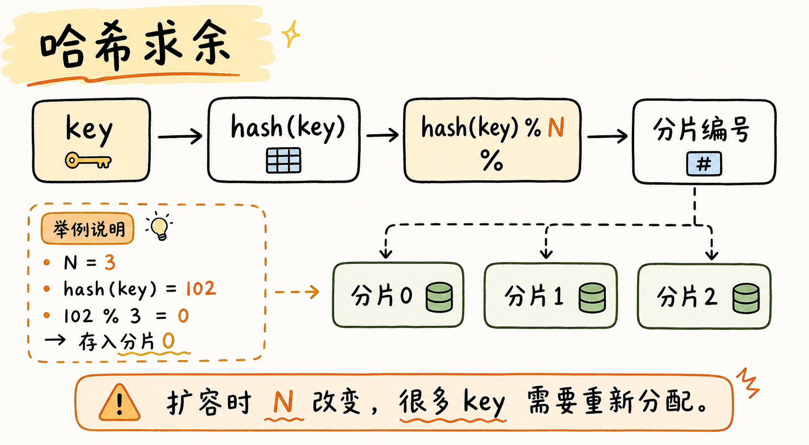
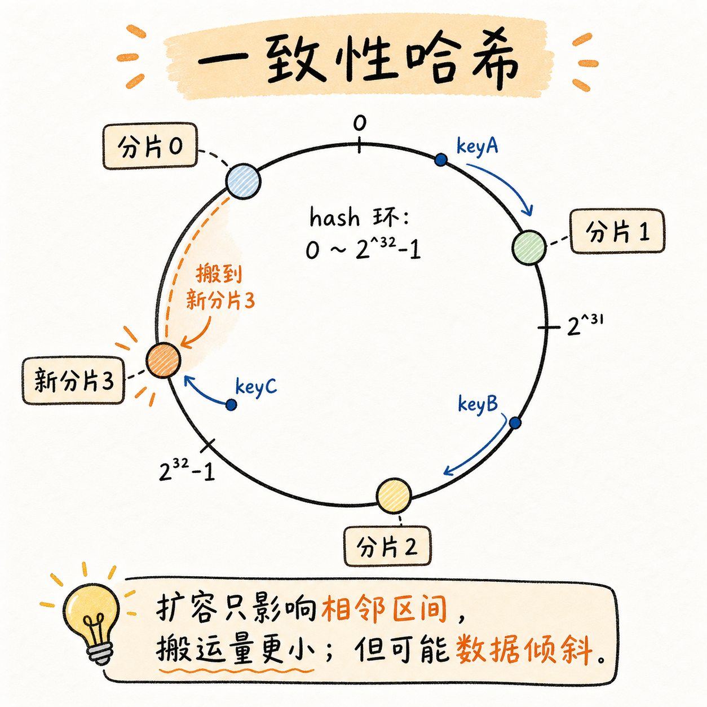
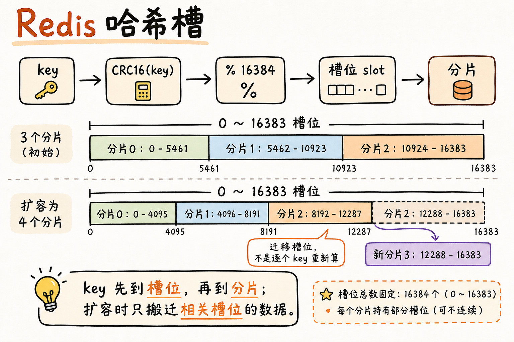

+++
title = "Redis 集群"
slug = "Redis-集群"
date = "2026-05-31T23:16:16+08:00"
lastmod = "2026-05-31T23:16:16+08:00"
draft = false
categories = ["Redis"]
description = "梳理 Redis Cluster 的分片思路：从哈希求余、一致性哈希，到 Redis 哈希槽和 16384 个槽位的设计取舍。"
+++

## 概述

其实集群的概念很广泛。广义上，只要多个机器共同组成一个分布式系统，都可以叫集群。之前的主从复制、哨兵模式，也可以看成广义集群。Redis 这里说的集群，一般指 Redis Cluster。它主要解决的是**存储空间不足**的问题：把数据拆到多台机器上，每台机器只保存一部分数据。

哨兵模式解决的是可用性问题，但本质上还是主从节点都保存完整数据。只要数据全集超过单机能承受的内存，就需要引入分片。

## 分片

分片这个其实很形象，就像把数据一片一片分开。分片就是把数据拆成多份，分别放到不同节点上。

**所以每一台机器上面的数据都是不一样的。**

比如有 1TB 数据，可以这样拆：

- 2 台机器，每台大约存 512GB。
- 3 台机器，每台大约存 300 多 GB。
- 4 台机器，每台大约存 256GB。

机器越多，每台机器承担的数据越少。但是实际部署时，每个存数据的主节点通常还要配从节点，用来提高可用性。所以扩容的时候并不是只需要一台，可能需要很多台机器。对于数据存放的思路，有以下几种算法可以实现。

## 哈希求余



哈希求余的思路是：

```txt
hash(key) % N
```

`N` 是分片数量。Redis 的数据都是 key-value 结构，所以可以先对 key 做 hash，再对分片数量求余，得到应该放到哪个分片。查询时也一样：key 不变，hash 函数不变，算出来的分片编号也不变。

这种方式简单，但是扩容很麻烦。因为一旦分片数量 `N` 改了，`hash(key) % N` 的结果会整体变化，很多数据都要重新搬运。

## 一致性哈希



一致性哈希把 hash 空间看成一个环，比如范围是 `0 ~ 2^32 - 1`。分片也落在这个环上，key 计算 hash 后，按环上的位置往顺时针跑，找到第一个分片的分割点，那就属于当前的分片。

就像图里的，原本只有分片 0、1、2。若新增分片 3，则扩容时不用让所有 key 重新分布，只需要搬动新节点影响到的一段数据。图中的 keyC 原本属于分片 0，现在顺时针跑遇到的第一个分片是 3，那么它就属于新分片 3 的范围。

优点：

- 比哈希求余的数据搬运量小。
- 扩容成本更低。

但有个问题是，如果节点分布不好，分片上的数据量可能不均匀，专业说法叫数据倾斜。

## Redis 哈希槽



Redis Cluster 真正采用的是哈希槽方案，将哈希求余和一致性哈希结合起来。

```txt
slot = CRC16(key) % 16384
```

Redis Cluster 固定有 `16384` 个槽位，也就是 `2^14` 个。key 不是直接映射到分片，而是先映射到槽位，再由槽位映射到分片。

流程可以理解为：key -> 槽位 -> 分片。

扩容或迁移时，不需要按单个 key 去重新分配，而是迁移一部分槽位。只有这些槽位对应的数据需要搬运，所以比简单的哈希求余更适合扩容。

例如 3 个分片时，可以大致这样分：

```txt
0 号分片：[0, 5461]
1 号分片：[5462, 10923]
2 号分片：[10924, 16383]
```

如果扩成 4 个分片，也可以从原来的几个分片中各拿出一部分槽位给新分片。这样每个分片大约持有 `4096` 个槽位。

## 槽位数量

Redis 使用 `16384` 个槽位，是一个折中的数量。可以简单算一下它的大小，看着很多，其实没占多少空间：

```txt
16384 bit = 2048 byte = 2KB
```

如果槽位太少，每个分片能分到的槽位少，数据均衡性不容易保证，某些槽位可能有很多 key，某些槽位也可能没有 key。

如果槽位太多，节点之间通信的元数据会变大。因为 Redis 之间需要通过心跳包检测各个节点的状态，如果槽位数量变成 `65536`，位图就会变成 `8KB`。虽然看着也不大，但是在这种频繁发送心跳包的场景里，网络带宽负担还是比较明显。

另外，每个节点需要表示自己持有哪些槽位，通常会用位图表示：第 `i` 位为 `1`，表示这个节点持有第 `i` 个槽位；第 `i` 位为 `0`，表示不持有。注意这里表示的是节点是否持有槽位，不是这个槽位里有没有 key。

## 总结

Redis Cluster 的核心是分片。主从复制和哨兵主要解决可用性，集群模式进一步解决单机存储容量限制。
